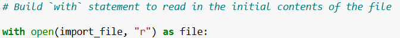
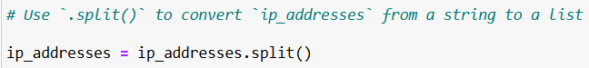

# Algorithm-for-file-updates-in-Python

## Project description

At a healthcare company, I was responsible for keeping access to sensitive patient data secure. Access was controlled through a file called `allow_list.txt`, which stored the IP addresses of employees permitted to log into a restricted subnetwork. A separate remove list identified employees who should no longer have access.
To streamline this process, I created a Python algorithm that automatically checked the `allow_list` against the `remove_list`. The script removed any IP addresses that appeared in both lists and updated the `allow_list` file with only the approved entries

## Open the file that contains the allow list

To begin, I stored the filename in a variable called `import_file`:

Then, I used a `with` statement to open the file:

The `with` statement ensures that the file is properly closed after it’s used. The `open()` function takes two arguments: the filename and the mode. In this case, `"r"` specifies that the file is being opened in read mode. I stored the file object in the variable `file`, which let me work with its contents inside the `with` block.

## Read the file contents

Next, I read the file contents using the `.read()` method:

The `.read()` method converts the contents of the file into a single string, which I stored in the variable `ip_addresses`. This gave me a starting point for processing the data further.

## Convert the string into a list

Because I needed to remove individual IP addresses, I converted the string into a list using the `.split()` method:

The `.split()` method breaks a string into a list, with each item separated by whitespace. Now each IP address was an element in a list, which made it easier to manage.

## Iterate through the remove list

The company also maintained a separate list called `remove_list` with IP addresses that needed to be revoked. To process these, I used a **for loop**:

This loop iterated through each IP address in `remove_list`, assigning each one to the loop variable `element`.

## Remove IP addresses that are on the remove list

Inside the loop, I checked whether the current `element` was also in `ip_addresses`. If it was, I used the `.remove()` method to delete it:

First, within my `for loop`, I created a conditional that evaluated whether or not the loop variable `element` was found in the `ip_addresses` list. I did this because applying `.remove()` to elements that were not found in `ip_addresses` would result in an error. 
Then, within that conditional, I applied `.remove()` to `ip_addresses`. I passed in the loop variable `element` as the argument so that each IP address that was in the `remove_list` would be removed from `ip_addresses`.

## Update the file with the revised list of IP addresses 

Once the unwanted IPs were removed, I needed to save the updated list back into `allow_list.txt`. First, I converted the list back into a string using `.join()`, separating each IP address with a newline character:

Then, I opened the file again in write mode and used `.write()` to overwrite its contents:

This replaced the old `allow_list` with the new one, ensuring that only the correct employees retained access.

## Summary

In this project, I built a Python algorithm that automatically updates a file of approved IP addresses by removing any that appear on a separate remove list. The process involved:
- Opening and reading the allow list file with a `with` statement and the `open()` function. 
- Converting the contents into a list using `.split()`.
- Iterating through the remove list with a `for loop`.
- Checking each entry and removing it from the list using `.remove()`.
- Converting the updated list back into a string with `.join()`.
- Writing the revised list back to the file with `.write()`.

This algorithm keeps the allow list accurate and reduces the chance of human error, ensuring that sensitive healthcare data remains accessible only to the right employees.
